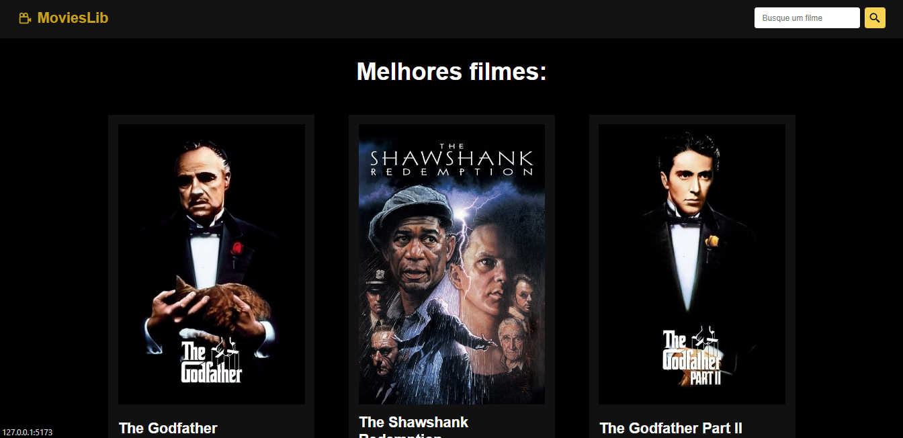

# Movie Library

Projeto desenvolvido por meio do canal no Youtube do Matheus Battisti - Hora de Codar.

## Demonstração do projeto

   

## O que foi realizado no projeto
* Consumo da API do TMDB.
* Filtrar os filmes melhores classificados.
* Ver os detalhes de cada filme.
* Input para buscar filmes.
* Deploy utilizando a Vercel.

## Tecnologias utilizadas
* Vite para criação do projeto ReactJS.
* ReactJS
* React Router
* React Hooks
* CSS3

## Rodando a aplicação

* npm install
* npm run dev

